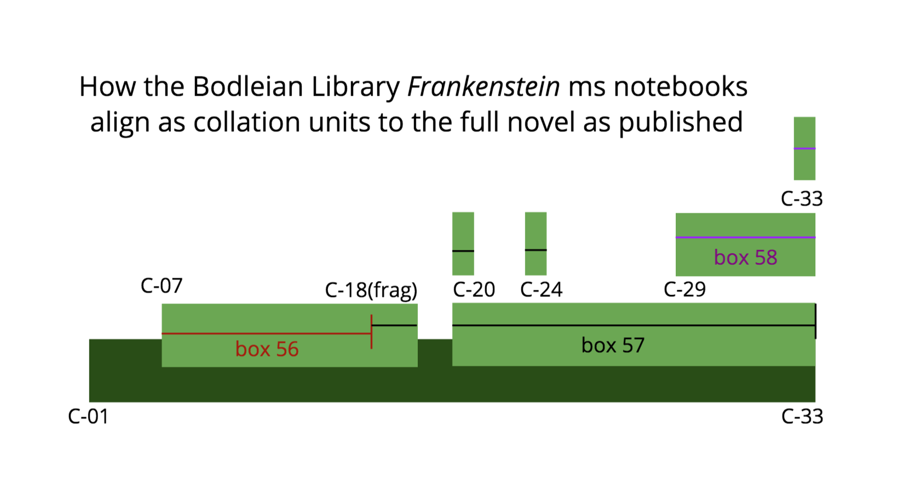

# Preparing Shelley-Godwin Archive files for collation

This describes the processing stages to prepare the Shelley-Godwin notebook files for collation. It links to files needed and names the directories in this repo to be used for each stage. 

The first stages of preparation begin in `sga_Notebooks` directory: 

1.  These files are assembled to represent their position in the c56, c57, and c58 boxes holding the notebook pages at the Bodleian Library. These represent one not-quite-continuous witness from c56 to c57 with some additional witness material in the form of second and third copies of particular passages in c57 and c58. 

1. The encoding must be "flattened". 

1. They are "chunked" according to 33 common alignment positions between all editions of the novel. Not every witness is present from the S-GA files. All witnesses must be present at all points for the computer-automated collation process to run. Where witness chunks are missing in S-GA, we prepare empty "dummy" files required for the collation process. 

1. 

